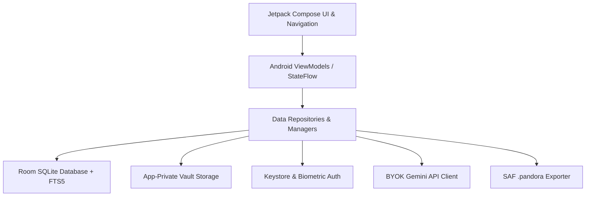
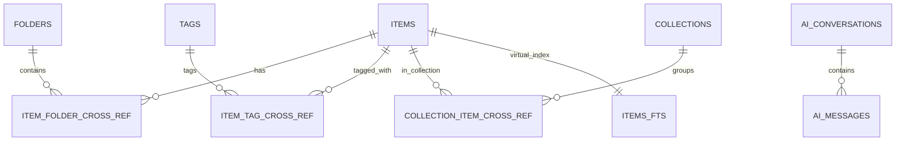

# Pandora Android App — Technical Architecture

## 1. System Philosophy & Non-Negotiables
1. **Local-First & Offline-Centric**: All user captures, notes, documents, voice memos, and taxonomies live strictly within the local SQLite database and app-private vault directory (`context.filesDir/vault/`).
2. **Organizer First, AI Second**: AI acts exclusively as an opt-in advisor. No taxonomy, folder, or tag change is committed without explicit user confirmation.
3. **Hardware Keystore BYOK Security**: User's Gemini API key is encrypted using hardware-backed AES-256 GCM via `MasterKey` in Android Keystore.
4. **Zero Lock-In Portability**: Full transactional export to standardized `.pandora` zip archives via the Android Storage Access Framework (SAF).

---

## 2. Core Architectural Layers

### Layer Breakdown
- **Presentation Layer (`feature/*`, `navigation`)**:
  - `feature/timeline`: Dynamic Bento 2-column masonry timeline feed (`TimelineScreen`, `HeroDiagramCard`, `ArticleTile`, `NoteTile`, `VoiceMemoTile`).
  - `feature/organize`: Structured repository hub (`OrganizeScreen`, Spotlight Carousels, Folder Accordions, Tag Cloud).
  - `feature/reader`: Content-aware reader (`ItemDetailScreen`, quote highlights, breadcrumbs, waveform).
  - `feature/search`: FTS5 full-text search with instant typing response and type pill filters (`SearchScreen`, `SearchViewModel`).
  - `feature/settings`: BYOK API key manager, Biometric Vault switch, and SAF Backup trigger (`SettingsScreen`).
  - `feature/capture` & `feature/proposal`: Quick Note bottom sheet, Link ingestion, and AI Organization proposal approval sheet.
- **Design System (`core/designsystem`)**:
  - Color Tokens: Japanese stationery porcelain palette (`PorcelainCanvas`, `PorcelainSheetWhite`, `IrisPrimary`, `ApricotOrange`, `CeruleanTertiary`, `DarkCapsuleSurface`).
  - Typography: Pairing Newsreader Serif headlines with Hanken Grotesk Sans interface copy.
  - Custom UI Components: `PandoraTopAppBar`, `PandoraBottomNav`, `FloatingCaptureCapsule`, `FilterPillChip`, `TaxonomyTagChip`.
- **Database & Storage Layer (`core/database`, `core/storage`)**:
  - `PandoraDatabase`: Room Database (v2) with entities: `ItemEntity`, `ItemFtsEntity`, `FolderEntity`, `TagEntity`, `CollectionEntity`, `ItemFolderCrossRef`, `ItemTagCrossRef`, `CollectionItemCrossRef`, `AiConversationEntity`, `AiMessageEntity`.
  - `VaultStorageManager`: Handles atomic writes to `filesDir/vault/`, URI copying, and file deletion.
- **Security & Portability Layer (`core/security`, `core/export`, `core/ai`)**:
  - `KeystoreSecretManager`: EncryptedSharedPreferences with AES-256 SIV/GCM for BYOK keys.
  - `BiometricAuthManager`: BiometricPrompt with strong biometric and device credential fallback.
  - `PandoraBackupManager`: Packages database schema and vault files into `.pandora` archive with `manifest.json`.
  - `GeminiClient`: Direct REST communication using BYOK key for structured JSON extraction and scoped item chat.

---

## 3. Database Schema Overview

